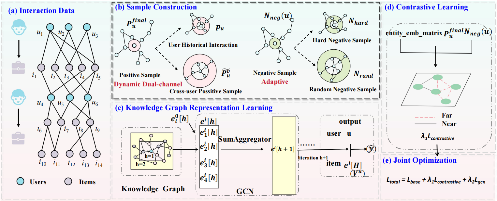

# DynKGCL

**DynKGCL** is a contrastive learning-based recommendation framework designed to address the challenges of **data sparsity** and **cold-start** in recommendation systems. It integrates a **dynamic dual-channel positive sample expansion** strategy with a **knowledge-graph-enhanced adaptive negative sampling** mechanism, significantly improving the robustness and generalization of user-item representation learning.

> **DynKGCL: Contrastive Learning for Recommendation with Dynamic Dual-Channel Positive Expansion and Adaptive Negative Sampling**  
> Ling Wen, Qihuiyang Liang, Shichao Li, Yuanyuan Zhang  
> 📌 *To appear in* **Applied Intelligence**, 2025. *(Preprint link will be added once available.)*

---

## 🖼️ Framework Overview

The following figure illustrates the overall architecture of DynKGCL:



---

## 🔧 Features

- Dynamic cross-user similarity propagation based on interaction sparsity
- Dual-channel positive sample expansion with KG-enhanced neighborhood mining
- Dataset-adaptive negative sampling: hybrid strategy for dense data, pure random for sparse data
- Effective on both sparse and dense recommendation scenarios

---

## 📁 Project Structure

```
DynKGCL/
├── data/
│   ├── movie1M/
│   │   ├── item_index2entity_id.txt     # MovieLens: item-to-entity mapping
│   │   └── kg.txt                       # Knowledge graph triples
│   │   └── ratings.dat                  # MovieLens-1M dataset
│   ├── music/
│   │   ├── item_index2entity_id.txt
│   │   ├── kg.txt
│   │   └── user_artists.dat             # Last.FM user-item interaction data
│   └── book/
│       ├── item_index2entity_id.txt
│       ├── kg.txt
│       └── BX-Book-Ratings.csv          # Book-Crossing dataset
├── src/
│   ├── preprocess.py                    # Data preprocessing & contrastive pair generation
│   ├── main.py                          # Main training script
│   ├── data_loader.py                   # Data loading utilities
│   ├── train.py                         # Training process, loss construction, optimizer
│   ├── model.py                         # DynKGCL model architecture (extended from KGCN)
│   ├── aggregators.py                   # Aggregation functions used in KG message passing
│   └── config.py                        
├── requirements.txt                    
└── README.md                            
```
---

## 📦 Installation

We recommend using a Conda virtual environment for isolation and compatibility.

```bash
# 1. Create a new environment with Python 3.6
conda create -n dynkgcl python=3.6 -y
conda activate dynkgcl

# 2. Install required packages using pip
pip install -r requirements.txt
```
---

## 🚀 Quick Start

### 1. MovieLens-1M

```bash
cd src
python preprocess.py -d movie1M --dim 64
python main.py --dataset movie1M
```

### 2. Music (Last.FM)

```bash
cd src
python preprocess.py -d music --dim 256
python main.py --dataset music
```

### 3. Book-Crossing

```bash
cd src
python preprocess.py -d book --dim 64
python main.py --dataset book
```

---

## 📊 Datasets

You can download the raw datasets from the following sources:

- **[MovieLens-1M](https://grouplens.org/datasets/movielens/1m/)**  
  Ratings and user-item interactions.

- **[Last.FM Dataset (HetRec)](https://grouplens.org/datasets/hetrec-2011/)**  
  Music listening data from Last.FM users.

- **[Book-Crossing (Hosted on GitHub)](https://github.com/xiaowen150/Book/)**  
  A preserved copy of the original Book-Crossing dataset.  
  > Originally provided by Cai-Nicolas Ziegler: http://www2.informatik.uni-freiburg.de/~cziegler/BX/ (now offline)

---

### 🔗 Knowledge Graph Files

To support knowledge-aware recommendation, each dataset requires the following additional files:

- `item_index2entity_id.txt`  
- `kg.txt`

These files were **directly copied from the official [KGCN repository](https://github.com/hwwang55/KGCN)**:

> Hongwei Wang, Jure Leskovec. *KGCN: Knowledge Graph Convolutional Networks for Recommender Systems*, KDD 2019.

We do **not** include these files in this repository to avoid duplication.  
Please download them from the KGCN GitHub repo or construct them by following their instructions.

Once prepared, place the files into the corresponding folder under `data/` (e.g., `data/music/`),  
and run `preprocess.py` to generate the required input files for DynKGCL.

---

## 💡 Notes

- The `dim` parameter in `preprocess.py` controls embedding dimensionality.
- `main.py` will automatically load default hyperparameters from `config.py` based on dataset.
- Contrastive sample pairs are generated into `contrastive_pairs.txt`.

---

## 📚 Citation

If you use this codebase in your research, please cite:

```bibtex
@article{DynKGCL2025,
  title   = {DynKGCL: Contrastive Learning for Recommendation with Dynamic Dual-Channel Positive Expansion and Adaptive Negative Sampling},
  author  = {Ling Wen and Qihuiyang Liang and Shichao Li and Yuanyuan Zhang},
  journal = {Applied Intelligence},
  year    = {2025},
  note    = {To appear}
}
```

> 📌 Please replace the venue and year with your actual publication details.

---

## 🙏 Acknowledgements

This project builds upon key components of the [KGCN (Knowledge Graph Convolutional Network)](https://github.com/hwwang55/KGCN) model:

- Hongwei Wang, Jure Leskovec. KGCN: Knowledge Graph Convolutional Networks for Recommender Systems. *KDD 2019*.

In particular, we adapted and extended modules related to:

- Knowledge graph structure parsing
- Neighbor aggregation functions
- KGCN-style entity embeddings

These parts were modified to support the contrastive learning framework proposed in DynKGCL. Full credit to the original authors for their foundational contributions.

---

## 📬 Contact

For questions, suggestions, or issues, feel free to open an issue or contact the authors directly.

---

## 📜 License

This project is licensed under the MIT License.

---